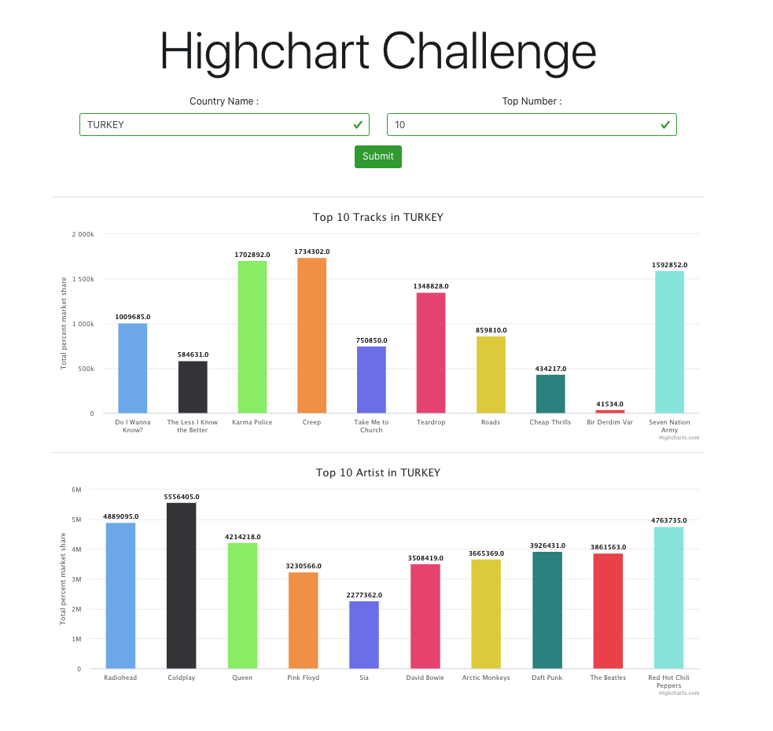

# React & Highcharts with Top Track & Top Artists in Country visualizes Application 

React & Highchart.js; I developed with. An application that you can access the best tracks and the best artist information in the country of your choice in detail and graphically.
The information is taken from the Last.fm REST API.

## Live Link of the Project

[https://ekremtas.github.io/fazlagidalivecode/](https://ekremtas.github.io/fazlagidalivecode/)

## Libraries I Use
[React](https://www.npmjs.com/package/react)

[Axios](https://www.npmjs.com/package/axios)

[reactstrap](https://www.npmjs.com/package/reactstrap)

[Highcharts](https://www.highcharts.com/)

## Run The Project
```
$ yarn install
```
After installing packages with

```
$ yarn start
```
You can run the project with.

# Sample Picture from the Project

